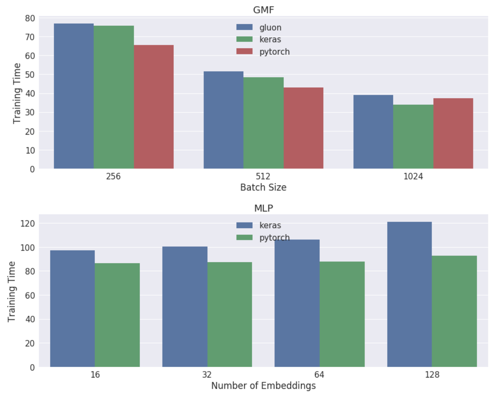

# Neural Collaborative Filtering with Keras, Pytorch and Gluon

This repo contains an implementation of [Xiangnan He, et al,
2017](https://www.comp.nus.edu.sg/~xiangnan/papers/ncf.pdf) neural
collaborative filtering in `Keras` (original paper), `Gluon` and `Pytorch`.
The `Keras` code is mostly borrowed from the author's original
[repo](https://github.com/hexiangnan/neural_collaborative_filtering), adapted
to the new `keras 2.2` API and `python 3`. Of course, I strongly recommend
reading their [paper](https://www.comp.nus.edu.sg/~xiangnan/papers/ncf.pdf).

Everything one needs to run the experiment is in this repo. The code is
organized as follows:

1. The core of the repo are of course the `GMF_DLFRAME.py`,
`MLP_DLFRAME.py` and `NeuMF_DLFRAME.py` where `DLFRAME` is `keras`,
`pytorch` and `gluon`

2. I have also included `data_preparation.py` and `data_comparison.ipynb`. The
first shows how to prepare the data for the experiment (not included in the
author's original
[repo](https://github.com/hexiangnan/neural_collaborative_filtering)) and the
second simply shows that the results of my data preparation and those of
Xiangnan He are consistent.

3. If you are just interested in a comparison between the results obtained
with `Keras`, `Pytorch` and `Gluon`, you can directly go to
`results_summary.ipynb`.

All the experiments run are included in  `run_net.sh`. If you clone this repo you could directly copy and paste the content in that file. For example, the following line will run a GMF model using `Gluon`, with batch_size 256, learning rate 0.01, 32 dim embeddings for 30 epochs:

`python GMF_gluon.py --batch_size 256 --lr 0.01 --n_emb 32 --epochs 30`

The best performing GMF and MLP models are included in the dir `models`.

Given the relative simplicity of the model, I thought this would be a good
exercise to illustrate the similarities and differences between the 3 frames .
In addition the results obtained turned out to be quite interesting.

The Figure below shows the *Hit Ratio* (HR) and *Normalized Discounted
Cumulative Gain* (NDCG) at k=10 for the MLP, GMF models and also the training
time for the MLP model.

<figure>

<figure>

Top: *Hit Ratio* (HR) and *Normalized Discounted Cumulative Gain* (NDCG) at
k=10 for both the GMF and MLP models vs the number of embeddings. Bottom:
training time for the GMF and MLP models per batch size and number of embeddings respectively.

For more details, go to `results_summary.ipynb`

Any suggestion, email me at: jrzaurin@gmail.com